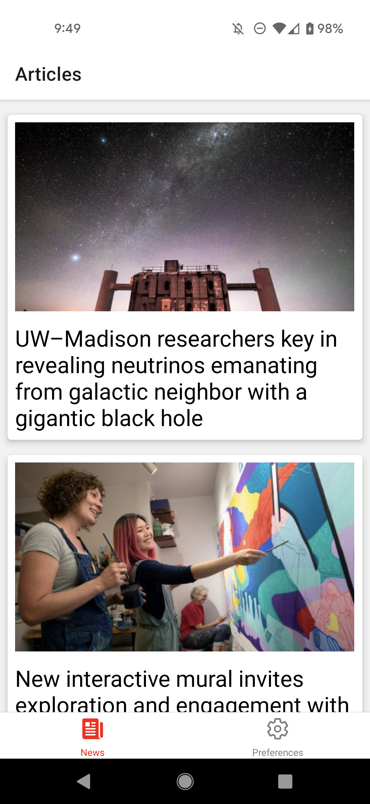
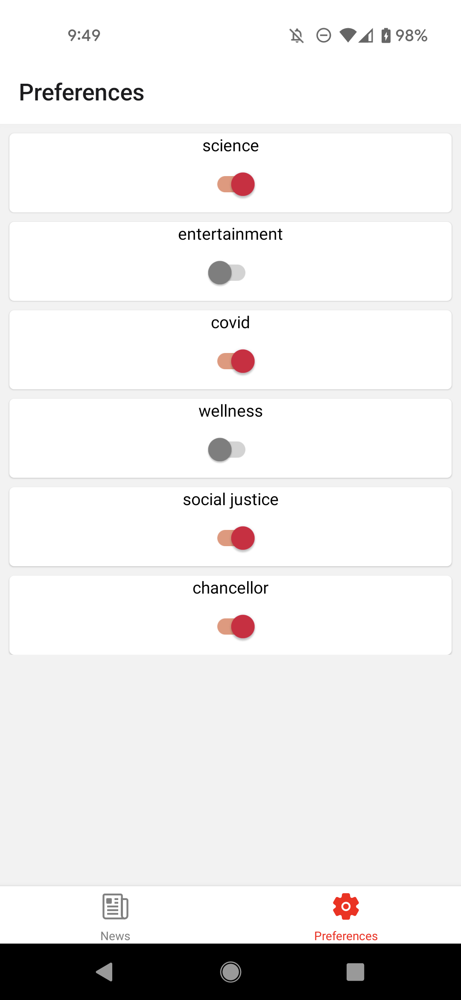
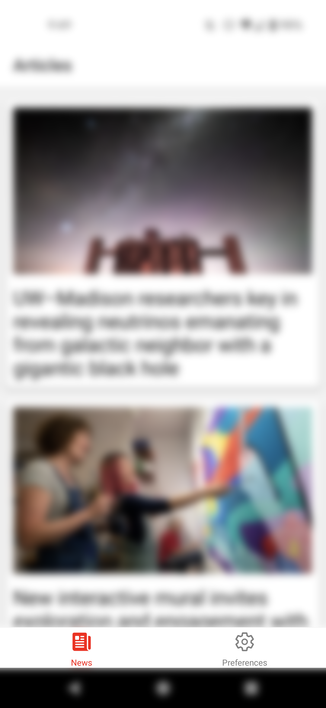

[](https://classroom.github.com/online_ide?assignment_repo_id=9260945&assignment_repo_type=AssignmentRepo)

# CS571 HW7: Badger News

Welcome to Badger News! For this assignment, you will complete a mobile application that allows badgers to get and customize news from their university using just a few taps on their phone!

Following, you will answer questions related to design patterns.  **Make sure to complete both parts of this assignment.**



## Badger News

The starter code provided to you was generated using [expo](https://expo.dev/) and all the necessary libraries for [react navigation](https://reactnavigation.org/) have already been added. See the `package.json` for details. **You should *not* re-run the expo init command**. Instead, in this directory, simply run...

```bash
npm install
npm start
```

To test your app, you have a few options. If you have a smart device, I would recommend using the expo app for [iOS](https://apps.apple.com/us/app/expo-go/id982107779) or [Android](https://play.google.com/store/apps/details?id=host.exp.exponent&hl=en_US&gl=US). You can scan the QR code using your phone, or you can launch commands via the terminal. Otherwise, you can use an emulator (such as [AVD](https://developer.android.com/studio/run/emulator)). Do not use the web browser to test your code; you must test on Android or iOS!

Note that we are writing code in JavaScript for React Native; if you begin writing code in Objective-C, Swift, Java, or Kotlin you are likely doing something *very* wrong!

### API Notes

All data can be retrieved via API calls to `https://www.coletnelson.us/cs571/f22/hw7/api/`. A brief overview of the API is provided below. There is no further documentation as this API only supports `GET` requests. Please use Postman to explore the API in greater depth.

`https://www.coletnelson.us/cs571/f22/hw7/api/news/articles` returns a short summary of each of the news articles including an `id`, `img`, `title`, and `tags`. You may assume the `id` is unique for each article.

`https://www.coletnelson.us/cs571/f22/hw7/api/news/articles/:articleId` returns the details for a particular article id, e.g. `:articleId` as `3`. **This endpoint is intentionally slow.** These details include all of the properties of the short summary as well as an additional `body` property containing an ordered array of body paragraphs.

`https://www.coletnelson.us/cs571/f22/hw7/api/news/tags` returns a list of all unique tags. These are guaranteed to be all the unique tags from the articles.

### Other Special Note

In this and following homeworks, we are using our existing knowledge of ReactJS and applying it to mobile devices. As such, they will be *much* more open-ended. Unless stated otherwise, any components, contexts, or functions made for you are merely *suggestions*, you may choose how to build your own app as long as it meets the requirements of the assignment!

### 1. React Navigation
Allow the user to navigate between two tabs: a tab for "News" and a tab for "Preferences". I would recommend using a BottomTabNavigator in `BadgerTabs.js` to navigate between screens for `BadgerNewsScreen.js` and `BadgerPreferencesScreen.js`. You do not need to add any options or styling to the tabs; we will re-visit this in Step 5. **You must use React Navigation for this requirement.**


### 2. Display News

Fetch the short news articles summaries from `https://www.coletnelson.us/cs571/f22/hw7/api/news/articles` and display them to the screen, including their image and title text. I'd recommend using `BadgerNewsItemCard.js` to display each short summary as a card. Use the article's `id` as the unique key.


### 3. Read News Article

When a news story is selected, the user should be able to read the additional body paragraphs about that story. They should be displayed a message along the lines of "The content is loading!" while waiting for the body paragraphs to load. Following, the user should be able to press a back button to return to the list of short summaries.

I would recommend implementing `BadgerNewsStack.js` with a native stack navigator that allows the user to switch between `BadgerNewsScreen.js` (all short summaries) and `BadgerNewsItemScreen.js` (detailed story). I would also recommend passing route params from `BadgerNewsScreen.js` to `BadgerNewsItemScreen.js` as a part of the navigation. After, I would expect your tab navigator to navigate to `BadgerNewsStack.js` rather than `BadgerNewsScreen.js`. 

**You must use React Navigation for this requirement.**


### 4. Apply Preferences

The user should be able to apply their preferences via the "Preferences" tab. By default, the user should opt in to all content. However, the user should be able to toggle preferences on/off. If the user has a preference toggled off, *any* news story with that tag should *not* be displayed to the user. If the user's preferences are so restrictive that there are no articles to be displayed, a message should be displayed saying so.

I would recommend using the `BadgerPreferencesContext.js` to store the users preferences. e.g. it may look like this...

```javascript
{
    "science": true,
    "entertainment": false,
    "covid": true,
    "wellness": false,
    "social justice": true,
    "chancellor": true
}
```

Furthermore, I would recommend using `BadgerPreferenceSwitch.js` which has already been implemented for you. This component is a wrapper around the `Switch` component and takes 3 props...

 - `initVal`: (optional) `true` or `false` if the switch should be on/off by default
 - `prefName`: the name of the preference, e.g. "wellness"
 - `handleToggle`: a 2-parameter callback function called on load and whenever the switch is toggled. The first parameter will be the preference name, and the second will be the *new value* of the switch. e.g. if the user toggles the covid preference off, `handleToggle` will be called with the first argument of "covid" and the second argument of `false`.




### 5. Navigation and Display Styling

If you haven't done so already, make sure that at most one header bar is shown at any time. For example, the following would lead to a *bad* user experience.


Pro Tip: Looking to get your [Third Party Library](https://canvas.wisc.edu/courses/324228/assignments/1691946) assignment done? Use a library such as [Ionicons](https://ionic.io/ionicons) or [Font Awesome](https://fontawesome.com/) to add icons to your tabs. **Using icons is a suggestion, not a requirement.**



### Other Notes
You may assume that each article has a unique `id`. You may *not* hardcode the number of articles *or* the names of preferences *anywhere*! Being a busy publishing firm in Madison, these may vary from day-to-day, and we should *not* assume that they remain the same.

### Submission Details
In addition to your code, **you will also need to submit a video recording of your app**. Like the demo video, it should cover all the tasks below. Please thoroughly demonstrate all tasks to showcase the capabilities of your app.

**Please embed your recording as a [Kaltura video](https://learning.kaltura.com/media/How+to+Embed+a+Kaltura+Media+in+the+Context+of+a+Canvas+Course/0_4weol2uv) as a part of the assignment submission.**

#### Tasks 
 - Show the short summaries of all news stories.
 - Read 2 specific news stories and navigate back to the main news screen.
 - Update the preferences to exclude 2 preferences and show that the news items have changed accordingly.
 - Update the preferences to exclude all preferences to show the warning message.

___

## Design Patterns

The questions below will ask you about the design of the Badger News app that you had just implemented. For each question, please write a response grounded in content from the "Design Patterns" lecture or other reputable sources.

1. Name a perceptible affordance within your app, what does it do? Then, name a hidden affordance that *could* be implemented, what would it do?

INSERT YOUR RESPONSE HERE.

As for a perceptible affordance, I will add a save tab in bottom. I will put it between news and preferences tabs. This tab allows user save articles to read later and is executable.Near by this tab, I will add a start icon to enable users to intuitively recognize actions that are possible with this save tabs.  

When it comes to hidden affordance, I plan to add a possible dark model for users. This affordance is not too obvious. It hiddend behind a drop down menu that only appears when the user is hovering over it. The clues that indicate this dark function are not obvious and may not even be displayed until the action is being taken. I think this function is rarely called, only when switching. So I design this one as a hidden affordance.

2. In your own words, briefly describe each of the three design paradigms that we discussed in class. What could be done to make our app design more metaphoric? What would be the benefits and consequences of a more metaphoric design?

INSERT YOUR RESPONSE HERE.

Firstly, implementation-centric is a direct implementation that directly demonstrates the functionality of the system。
Next, metaphorical design simulates a real-life scenario.It makes users feel that the product on the screen is close to the real-world usage scenario. Idiomatic design requires users to learn by themselves. After the user has learned a certain function, he can master how to manipulate the product. 

I can display user favorites in the save interface by simulating real-world bookshelves and newsstands. For a more metaphoric design,it works well in expert interfaces where the interface simulates a real-world system. However, for a more metaphoric design, it is difficult to achieve without a similar scenario in the real world.


3. Briefly describe the business goal(s) and posture level of this application. Then, what is a task a user may try to accomplish? How does your app support this task?

INSERT YOUR RESPONSE HERE.

In my opinion, the business goals are making money and provide information to user. As to posture level, the type of this app is news. 

For tasks, user can set their preferences by preference screen and switching button. And they can read body of the article by cliking the article card and back to the article lists. My app support this task by a stack screen. 
